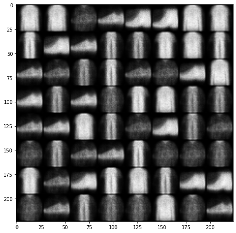

# Tests regarding the [FashionMNIST](https://github.com/zalandoresearch/fashion-mnist) dataset

In this file we present the results of some tests we conducted to assert how the VAE and betaVAE models perform on simple Datasets, like the [FashionMNIST](https://github.com/zalandoresearch/fashion-mnist).

The fixed configuration used for the following experiments is:

- Convolutional Layers = 3
- Convolution Channels = \[128, 256, 512\]
- Convolution Kernel Sizes = \[(7, 7), (7, 7), (5, 5)\]
- Convolution Strides = \[(1, 1), (1, 1), (1, 1)\]
- Convolution Paddings = \[(1, 1), (1, 1), (1, 1)\]

- Epochs = 3
- Batch Size = 32
- Learning Rate = 1e-5
- beta = 3
   

Let's see what happens when we change the dimension of the latent vector z:

   
- Latent Vector Dimension = 1
    
    - VAE

        Sample

        

        Reconstruction

        

    - B-VAE

        Sample

        

        Reconstruction

        

   
- Latent Vector Dimension = 2

    - VAE

        Sample

        

        Reconstruction

        

    - B-VAE

        Sample

        

        Reconstruction

        

   
- Latent Vector Dimension = 8

    - Sample

        

        Reconstruction

        

    - B-VAE

        Sample

        

        Reconstruction

        
   

- Latent Vector Dimension = 16

    - Sample

        

        Reconstruction

        

    - B-VAE

        Sample

        

        Reconstruction

        
   

## Observations

We can see a clear tradeoff for increasing the dimension of the latent vector z:
- Increasing the dimension helps in reconstructing the images more accurately
- Decreasing the dimension helps in better sampling, as higher dimension latent vectors sample sharper images
