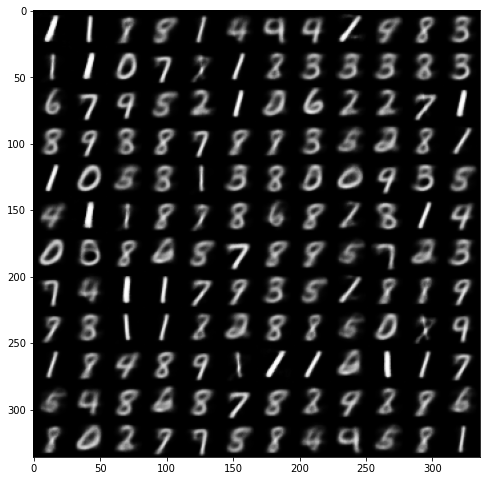
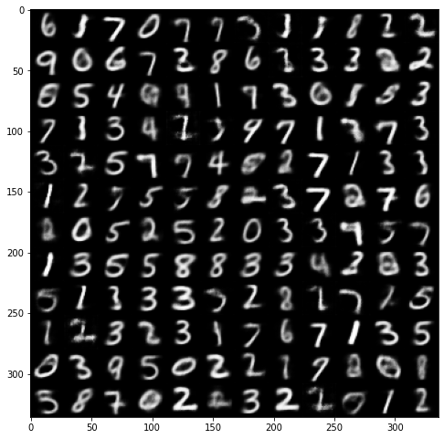
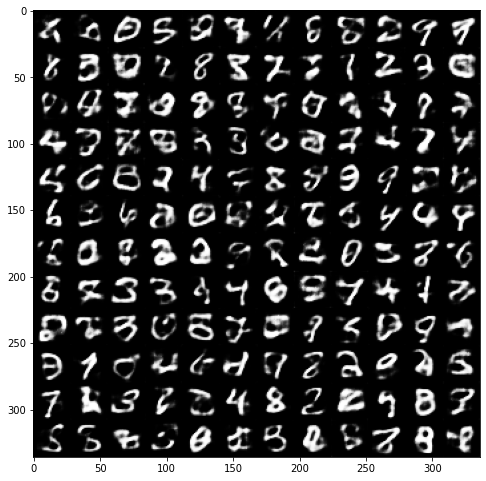
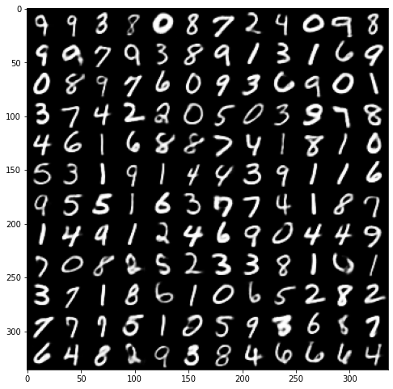
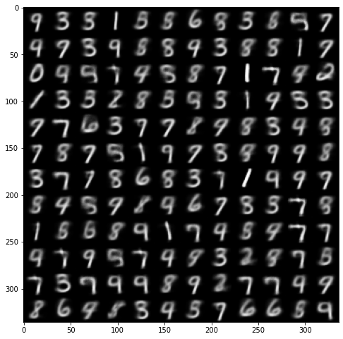
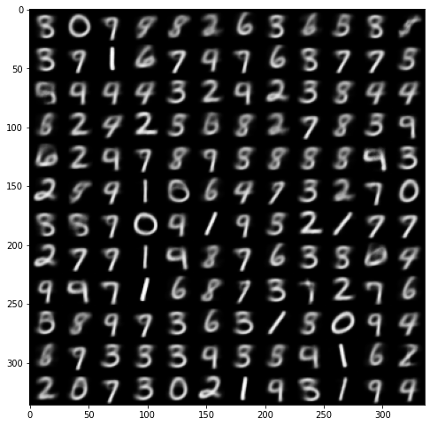
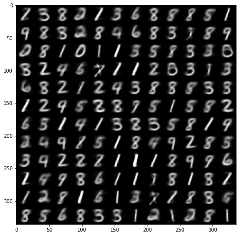
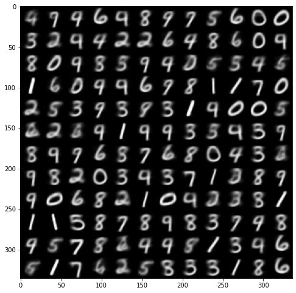
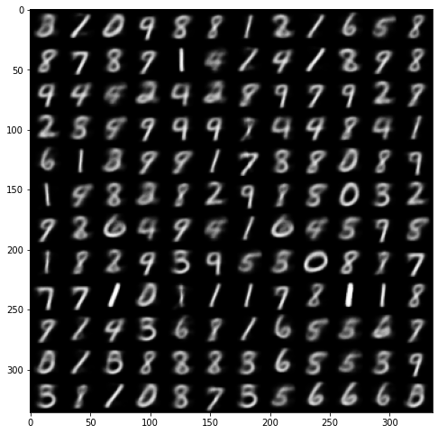
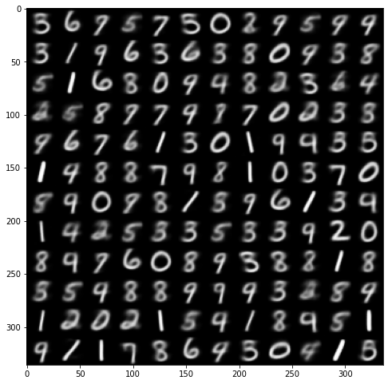

# Tests regarding the [MNIST](http://yann.lecun.com/exdb/mnist/) dataset
The following tests were executed with both the simple and the disentangled variation of the Variational Autoencoder implemented.
The architecture of the model remains the same and the only parameter that changes is the dimension of the latent vector (z_dimension).
Analytically, for all the following tests:
- Convolutional Layers = 3
- Convolution Channels = \[64, 128, 256\]
- Convolution Kernel Sizes = \[(7, 7), (7, 7), (5, 5)\]
- Convolution Strides = \[(1, 1), (1, 1), (1, 1)\]
- Convolution Paddings = \[(1, 1), (1, 1), (1, 1)\]

- Epochs = 10
- Batch Size = 16
- Learning Rate = 3e-6

## VAE

#### Latent Vector Dimension = 2

Sample Images:

#### Latent Vector Dimension = 4

Sample Images:

#### Latent Vector Dimension = 16

Sample Images:

If you look closely, these digits resemble the handwriting of doctors.

Reconstructed Images:

## B-VAE
The following tests will be executed with the same configuration as above, and also the latent vector dimension is constant at 2. Hence the only thing that is tweaked is "beta"

#### Beta = 4

Sample Images:

Reconstructed Images:

#### Beta = 80

Sample Images:

Reconstructed Images:

#### Beta = 150

Sample Images:

Reconstructed Images:

